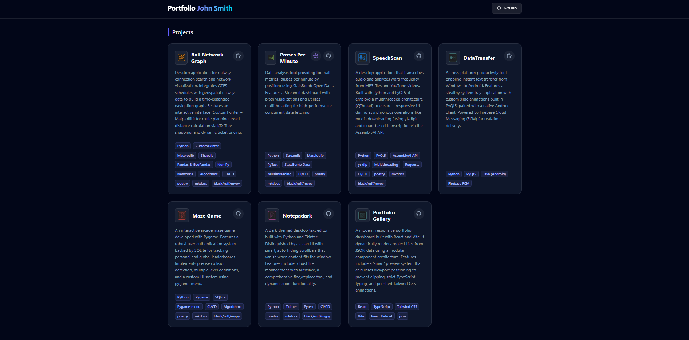
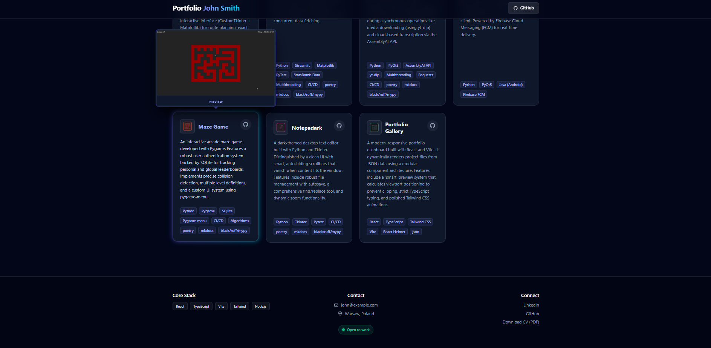

# 🧑‍💻 Portfolio-Gallery

**Portfolio-Gallery** is a clean, dark-themed portfolio site built with
**Vite**, **React**, **TypeScript**, and **Tailwind CSS**. It showcases
your projects as elegant cards with on‑hover **live previews**, includes
a sticky header, accessible footer with contact links, and SEO metadata
via **react-helmet-async**.

------------------------------------------------------------------------

## ⚙️ Technologies

-   **Vite**
-   **React** 18 + **TypeScript**
-   **Tailwind CSS**  styling
-   **react-helmet-async**

------------------------------------------------------------------------

## 🧠 Overview

This portfolio renders projects from JSON and displays them as
**cards**. Each card shows an **icon**, **name**, **description**,
**tech tags**, and links to **demo website** / **repo**. When a preview image (or gif) is available, a **hover popup** shows a framed screenshot that
auto‑positions **above/below** the card based on viewport space.

------------------------------------------------------------------------

## ✨ Features

-   📦 **Data‑driven** projects via `projects.json`
-   🧩 **Type‑safe** models for `Project` and `Profile`
-   🖼️ **Hover preview popup** with smart top/bottom positioning
-   🧭 **Sticky header** with GitHub button
-   🦾 **Accessible footer** with contact, socials, and tech stack
-   🔖 **SEO tags** via Helmet
-   📱 **Responsive grid** (1--4 columns)
-   ⚡ **Vite + dynamic imports** for icons/screens
-   🌗 **Dark UI** with subtle glass & glow effects

------------------------------------------------------------------------

## 🗂️ Project Structure

    portfolio/
    ├─ public/
    │  └─ icon.svg                     # Favicon
    ├─ src/
    │  ├─ assets/
    │  │  ├─ data/
    │  │  │  ├─ profile.json           # Basic profile + socials
    │  │  │  └─ projects.json          # Portfolio projects
    │  │  ├─ icons/                    # Per‑project icons
    │  │  └─ screens/                  # Per‑project preview images/gifs
    │  ├─ components/
    │  │  ├─ Header.tsx                # Header component
    │  │  ├─ Footer.tsx                # Footer component
    │  │  └─ ProjectCard.tsx           # Project-card component
    │  ├─ types.ts                     # Project/Profile types
    │  ├─ App.tsx                      # Page shell + Helmet + grid
    │  ├─ main.tsx
    │  └─ index.css
    ├─ index.html

------------------------------------------------------------------------

## 🧩 Data Models

### `types.ts`

``` ts
export type Project = {
  id: string;
  name: string;
  description: string;
  icon: string;
  preview?: string;
  technologies: string[];
  demoUrl?: string;
  repoUrl: string;
};

export type Profile = {
  username: string;
  location: string;
  openToWork: boolean;
  techStack: string[];
  cvUrl?: string;
  socials: {
    email: string;
    github: string;
    linkedin?: string;
  };
};
```

### `assets/data/profile.json` (example)

``` json
{
  "username": "John Smith",
  "location": "Warsaw, Poland",
  "openToWork": true,
  "techStack": ["React", "TypeScript", "Vite", "Tailwind", "Node.js"],
  "cvUrl": "/cv.pdf",
  "socials": {
    "email": "john@example.com",
    "github": "https://github.com/johnsmith",
    "linkedin": "https://www.linkedin.com/in/johnsmith/"
  }
}
```

### `assets/data/projects.json` (example)

``` json
[
  {
    "id": "notepadark",
    "name": "Notepadark",
    "description": "Dark‑themed text editor with autosave, search & replace.",
    "icon": "notepadark.svg",
    "preview": "notepadark.png",
    "technologies": ["Python", "Tkinter"],
    "demoUrl": "https://example.com/notepadark",
    "repoUrl": "https://github.com/you/notepadark"
  },
  {
    "id": "portfolio",
    "name": "Dev Portfolio",
    "description": "This site — Vite + React + TS + Tailwind.",
    "icon": "portfolio.svg",
    "preview": "portfolio.png",
    "technologies": ["React", "TypeScript", "Tailwind"],
    "repoUrl": "https://github.com/you/portfolio"
  }
]
```

------------------------------------------------------------------------

## 🖼️ Screenshots

### Main Grid & Card Hover



### Project Preview Popup

